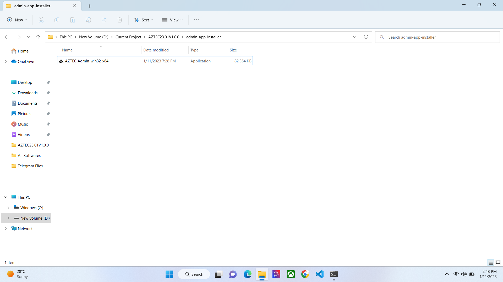
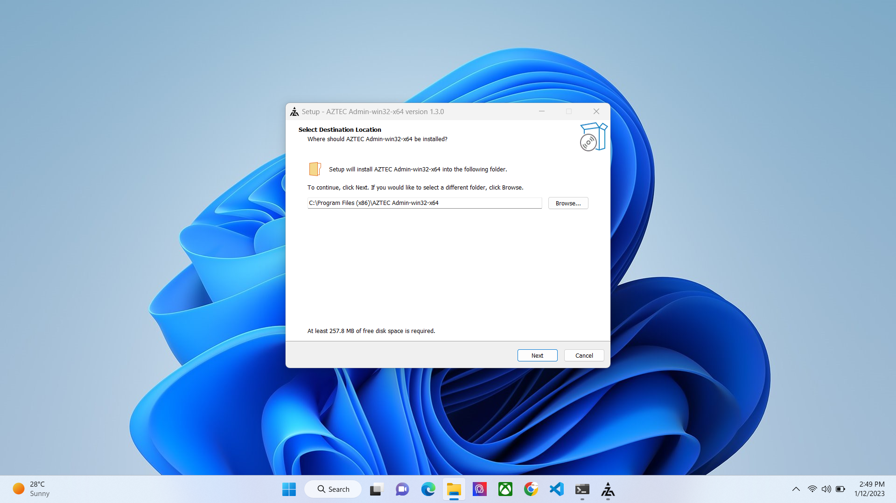
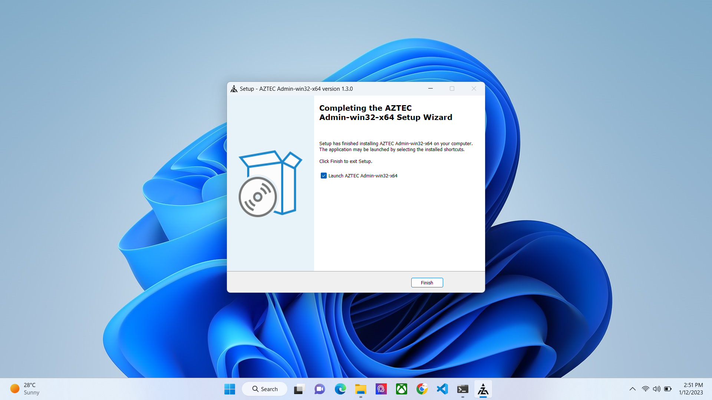
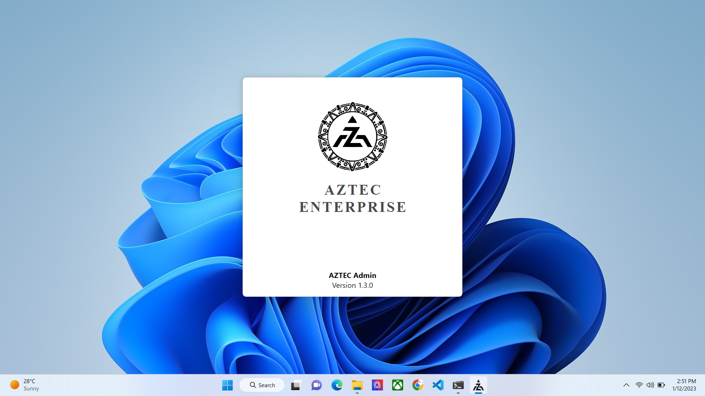
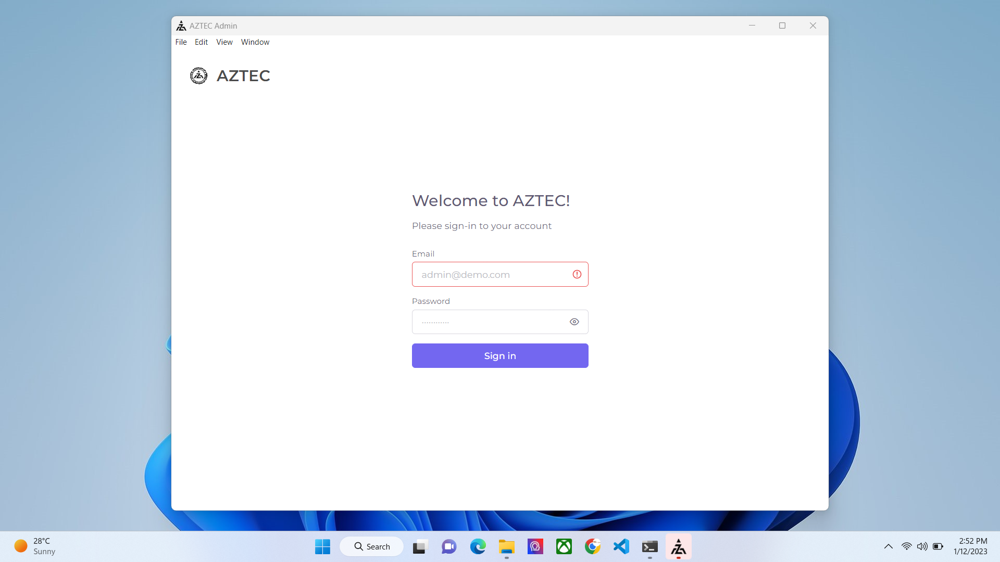
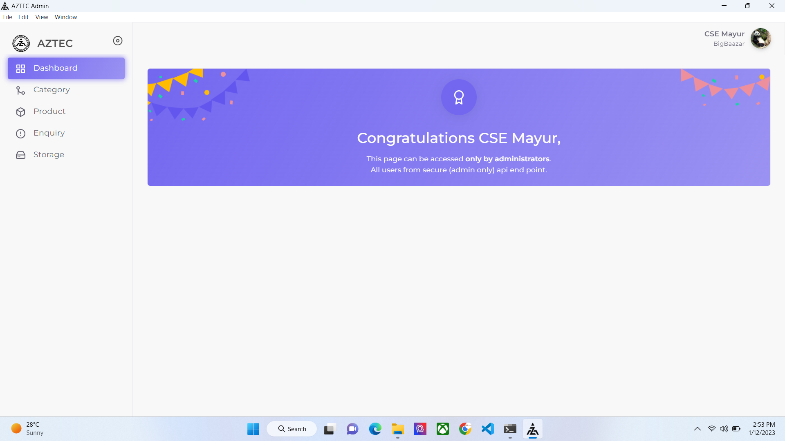
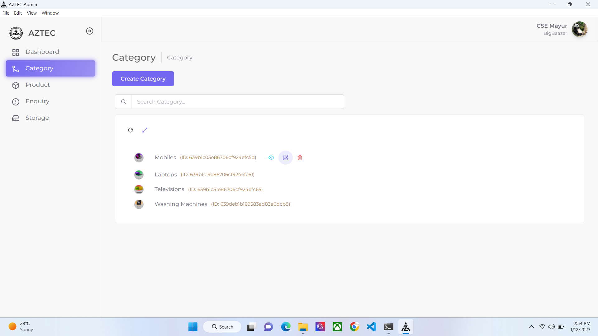
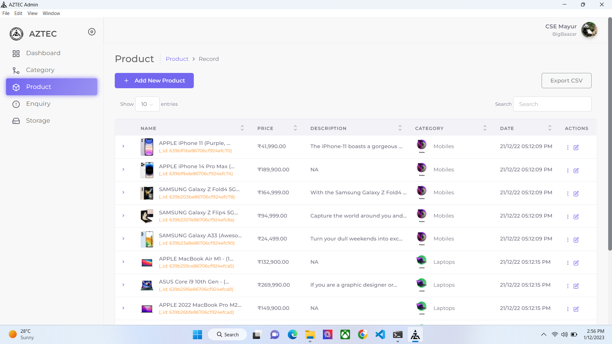
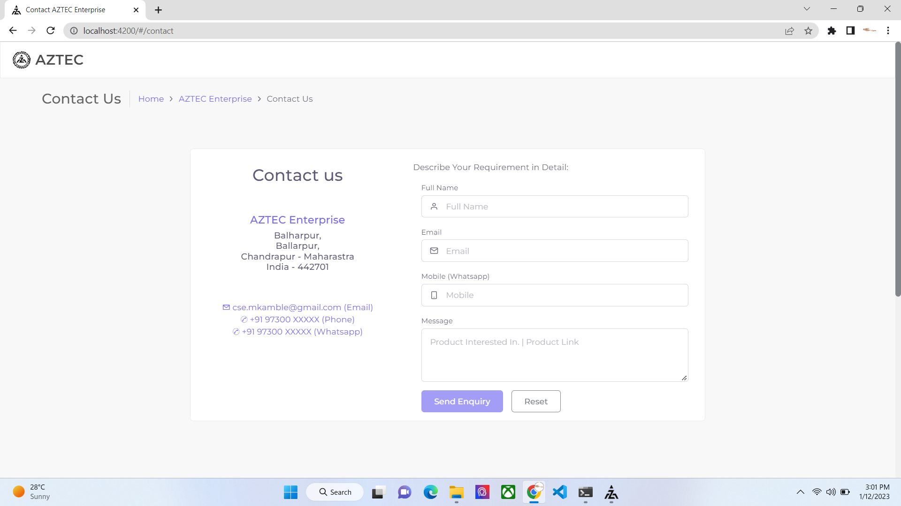
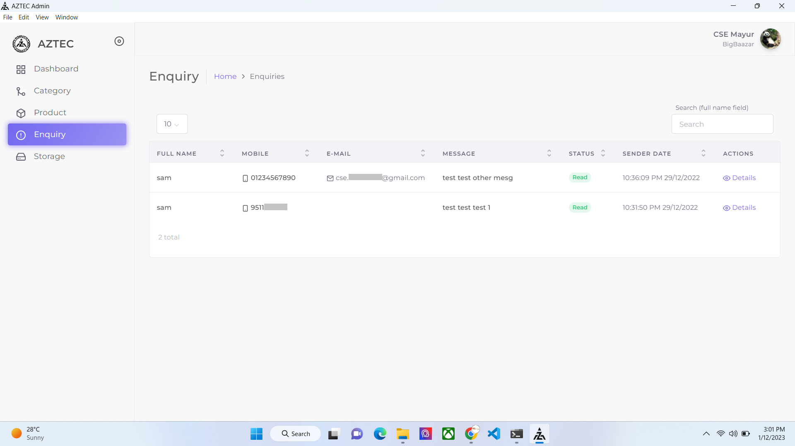

# __AZTEC ENTERPRISE - Admin Application__

__AZTEC Admin App -__ The AZTEC Admin Application is used to manage the [www.aztec-enterprise.in](https://www.aztec-enterprise.in) website, it is desined for admin to effectively controll operations like listing new products, catagory, pricing details about the products, managing customers and their orders. This application strongly manage database and images(remove or add) in the cloud computer.

## Application Download Link
[AZTEC Admin Application](https://github.com/aztec-enterprise/aztec-admin-app/releases)

https://github.com/aztec-enterprise/aztec-admin-app/releases

## Installation
The installation of this application is very easy just click on __[setup.exe](https://github.com/aztec-enterprise/aztec-admin-app/releases)__ file and follow the directions, the installation is safe and secure for your windows you can ignore any warnings.

## Startup Page
This is the start up page for this software, there must be authenticed used in order to login to the application.

## Category Manage
### Operation
* Create new category.
* Create new sub category to select category, when we want to add category into some-one catgory.
* Read category, for check detail.
* Update category, when we want to changes detail.
* Delete category, this will be remove category.

## Products Manage

### Operation
* Create product, this operation add new product detail like name, price, category, highlight describetion and images.
* Search product, this operation will be searching product name or category.
* Read product, check the product detail with images.
* Update product, this.operation changes the product detail by select product.
* Delete product, when product create accidently or wrong detail, then will be use this operation.

## Equiries Manage
When customer sent any queries(messages) from [www.aztec-enterprise.in/contact](https://www.aztec-enterprise.in/contact) website, then this application will be check this contact query(message) and this application will be notify to admin owner.

